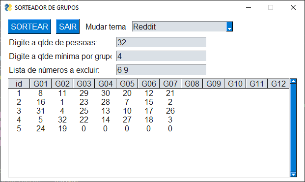

# Script para sorteio de grupos de alunos

### sorteio_grupos.py
Função usada para sorteio de grupos onde:

```
Quantidade de participantes -> qtde_part=34,
Quantidade mínimo por grupo -> qtde_min_grupo=4
```
```py
Retorna:
    { "sorteio": sorteio,               # Lista sorteada
      "total_grupos": total_grupos,     # Qtde de grupos
      "resto": resto,                   # Restante dos participantes (debug)
      "qtde_part": qtde_part,           # Qtde de participantes
      "qtde_min_grupo": qtde_min_grupo, # Qtde mínima no grupo
      "grupos": df_grupos               # DataFrame Pandas dos grupos soteados
    }
``` 

### sorteio_grupos_gui_pg.py
GUI feita em [PySimpleGUIQt](https://www.pysimplegui.org/en/latest/) para o sorteio dos grupos


### sorteio_grupos_gui_st.py
GUI feita com [Streamlit](www.streamlit.com) para o sorteio dos grupos


> Requerimentos
>```
>Python >= 3.6
>pandas >= 1.5
>PySimpleGUIQt >= 0.35.0
>streamlit >= 1.17.0
>```
>```
>pip3 install pandas PySimpleGUIQt streamlit --user
>```
[](https://www.sp.senai.br)
